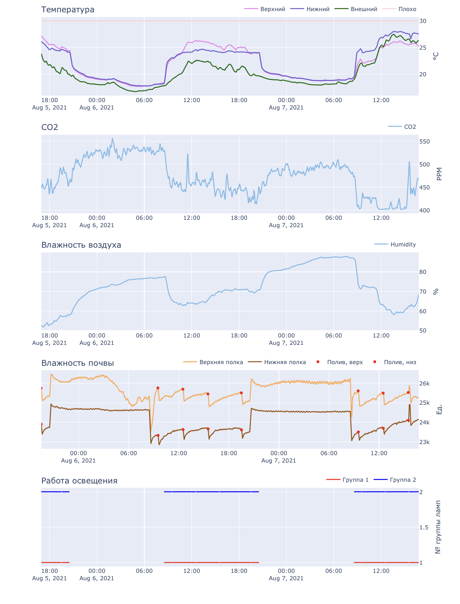

# Growbox panel

# Prepare
Add `config/db.py` file with the following content
```
USER = 'username'
PASSWORD = 'password'
DATABASE = 'growbox'
HOST = 'mysqlhost'
PORT = 'masqlport'
```

# Running
```
sudo docker build --tag panel ./
sudo docker run panel
```

# Example

